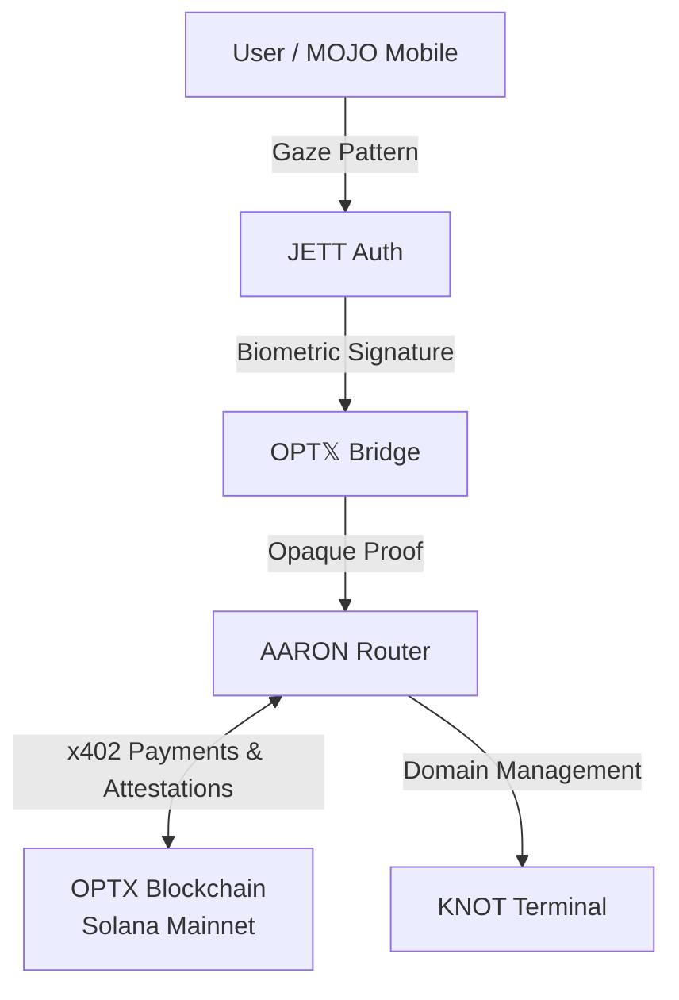

# aaron-router

The official public router and SDKs for the OPTX network.

## System Architecture



## Naming Hierarchy

| Name | Full | Role |
|------|------|------|
| **JETT Auth** | Joule Encryption Temporal Template Auth | Biometric gaze signature + SSO on Jetson |
| **OPT𝕏** | Optical Program Technologic 𝕏tension | Secure bridge: JETT Auth → on-chain proofs |
| **AARON** | Asynchronous Audit RAG Optical Node | On-chain protocol + private edge router |
| **OPTX** | Public Blockchain & Token Network | Solana mainnet tokens and protocol |
| **AGT** | Agentive Gaze Tensor | COG/EMO/ENV tensors — performs Web4 actions for JETT Auth |

## Quick Start

```bash
pip install -r requirements.txt
python aaron_router.py
```

Aaron starts on port 8888 by default. Override with `AARON_PORT` env var.

## Endpoints

| Method | Path | Description |
|--------|------|-------------|
| `GET` | `/health` | Service health check |
| `POST` | `/session` | Create auth session (returns QR payload) |
| `GET` | `/session/{id}` | Poll session status |
| `POST` | `/verify` | Submit gaze proof |
| `POST` | `/gaze/analyze` | Classify iris landmarks into AGT regions |

## SDK

### Python

```python
from sdk.python.aaron_client import AaronClient

client = AaronClient("https://api.astroknots.space/aaron")
session = client.create_session(wallet_address="your-solana-pubkey")
# Show session["qrPayload"] as QR code
# MOJO app scans QR → submits gaze proof → session becomes "verified"
status = client.poll_session(session["sessionId"])
```

### TypeScript

```typescript
import { AaronClient } from './sdk/typescript/aaron-client'

const aaron = new AaronClient('https://api.astroknots.space/aaron')
const session = await aaron.createSession({ walletAddress: 'your-pubkey' })
// Show session.qrPayload as QR code
const result = await aaron.waitForVerification(session.sessionId)
console.log(result.agtWeights) // { cog: 0.33, emo: 0.33, env: 0.33 }
```

## Auth Flow

```
┌─────────┐     ┌──────────────┐     ┌───────────┐     ┌──────────┐
│ Frontend │────>│ AARON Router │────>│SpacetimeDB│────>│  Solana  │
│ (Next.js)│<────│ (Jetson Edge)│<────│ (Edge DB) │<────│(Mainnet) │
└─────────┘     └──────────────┘     └───────────┘     └──────────┘
     │                  │
     │  1. POST /session│
     │  2. Show QR      │
     │                  │
     │    MOJO App      │
     │  3. Scan QR ────>│
     │  4. Gaze capture │
     │  5. POST /verify │
     │                  │
     │  6. Poll status  │
     │  7. "verified" ──│──> Attestation on Solana via OPT𝕏
     │                  │
```

## AGT Regions

The **Agentive Gaze Tensor** maps eye gaze to three cognitive regions:

| Region | Zone | Description |
|--------|------|-------------|
| **COG** | 1 (upper) | Cognitive focus — analytical attention |
| **EMO** | 2 (lower-left) | Emotional processing — empathetic awareness |
| **ENV** | 3 (lower-right) | Environmental scanning — spatial awareness |

Entropy is calculated via Shannon entropy of the AGT weights. Higher entropy (more varied gaze pattern) = stronger authentication.

## Environment Variables

| Variable | Default | Description |
|----------|---------|-------------|
| `AARON_PORT` | `8888` | Server port |
| `SPACETIMEDB_URL` | `http://127.0.0.1:3000` | SpacetimeDB instance |
| `SOLANA_RPC_URL` | Helius RPC | Solana RPC endpoint |
| `ALLOWED_ORIGINS` | `https://jettoptics.ai,...` | CORS origins (comma-separated) |

## On-Chain Addresses

| Token | Network | Address |
|-------|---------|---------|
| $OPTX | Devnet | `4r9WxVWBNMphYfSyGBuMFYRLsLEnzUNquJPnpFessXRH` |
| $JTX | Mainnet | `9XpJiKEYzq5yDo5pJzRfjSRMPL2yPfDQXgiN7uYtBhUj` |
| $CSTB | Devnet | `4waAimBGeubfVBp4MX9vRh7iTWxoR2RYYqiuChqCH7rX` |
| DePIN Program | Devnet | `91SqPNGRFrTgwSM3S7grZK8A6TCqn5STFGK4mAfqWMbQ` |

## License

MIT — Built by [Jett Optics](https://jettoptics.ai)
